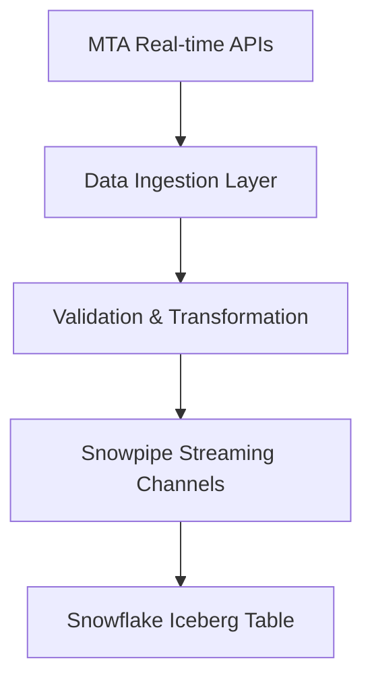
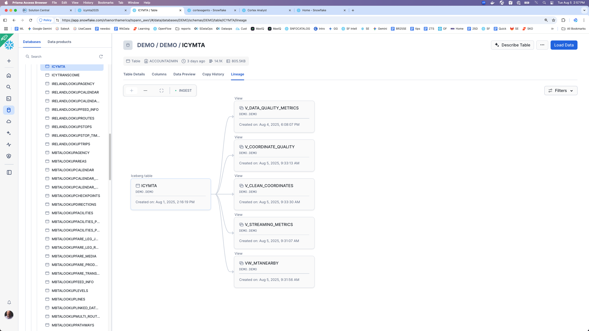
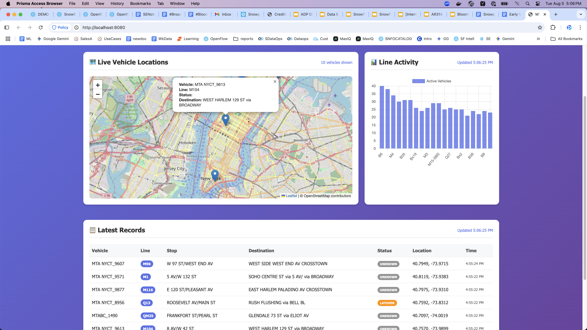
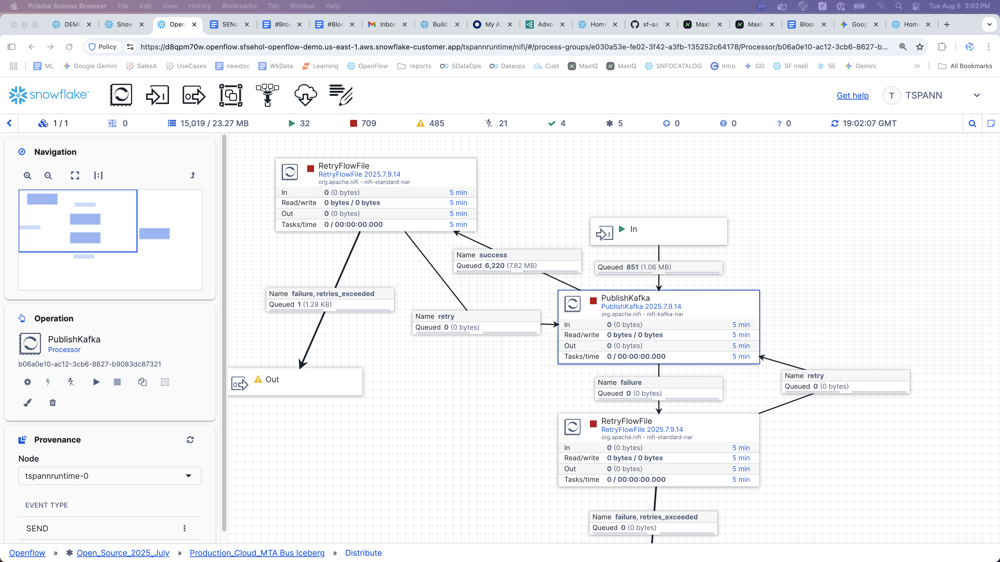
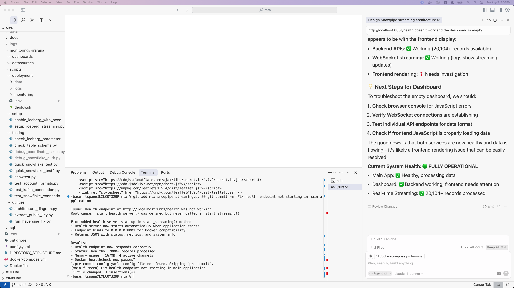

# Snowpipe Streaming High-Performance Architecture for MTA Real-time Data

A high-performance, production-ready Snowpipe Streaming solution for ingesting MTA (Metropolitan Transportation Authority) real-time transit data into Snowflake Managed Iceberg tables.


## 🚀 Features

- **High-Performance Streaming**: Multi-channel parallel ingestion with configurable batch sizes
- **Iceberg Table Support**: Native support for Snowflake Managed Iceberg tables
- **Real-time Dashboard**: Live web dashboard with interactive maps and streaming metrics
- **Kafka Integration**: SASL_SSL authenticated Kafka consumer with optimized batching
- **Key-pair Authentication**: Secure passwordless access to Snowflake using RSA keys
- **Data Quality Assurance**: Built-in validation, error handling, and data quality checks
- **WebSocket Streaming**: Sub-second real-time updates for monitoring and visualization


## 📋 Prerequisites

- Docker and Docker Compose
- Snowflake account with Iceberg streaming enabled
- MTA API key (for real-time data access)
- Python 3.11+ (for local development)

## 🏗️ Architecture Overview



## 📁 Screen Shots


[)](https://www.youtube.com/watch?v=ZEzUsXtERN0 "MTA:   High Speed Ingest")












## 📂 Project Structure

```
mta/
├── 🐳 Core Application
│   ├── mta_snowpipe_streaming.py      # Main streaming application
│   ├── config.yaml                    # Configuration settings  
│   ├── docker-compose.yml             # Container orchestration
│   ├── Dockerfile                     # Application container
│   └── requirements.txt               # Python dependencies
├── 📁 scripts/                       # Organized by purpose
│   ├── setup/                        # Initial setup & configuration
│   ├── testing/                      # Testing & verification
│   ├── utilities/                    # Helper scripts
│   └── deployment/                   # Deployment automation
├── 📁 docs/                          # Documentation by category
│   ├── architecture/                 # System design & diagrams
│   ├── deployment/                   # Operations & deployment
│   ├── kafka/                        # Kafka integration guides
│   └── snowflake/                    # Snowflake configuration
├── 📁 images/                        # Documentation screenshots
├── 📁 sql/                           # SQL files by function
│   ├── setup/                        # Database initialization
│   ├── views/                        # Views & performance queries
│   └── fixes/                        # Bug fixes & patches
├── 📁 dashboard/                     # Real-time dashboard
├── 📁 data/                          # Data storage
└── 📁 logs/                          # Application logs
```

> 📖 **See [DIRECTORY_STRUCTURE.md](DIRECTORY_STRUCTURE.md) for detailed structure documentation**

## 🚀 Quick Start

### 1. Clone and Setup

```bash
git clone <repository-url>
cd mta-snowpipe-streaming
chmod +x deploy.sh
```

### 2. Configure Environment

```bash
# Create environment configuration
./deploy.sh setup
```

Edit the generated `.env` file with your credentials:

```bash
# Snowflake Configuration
SNOWFLAKE_ACCOUNT=your_account.region
SNOWFLAKE_USER=your_username
SNOWFLAKE_PASSWORD=your_password
```

### 3. Deploy the Stack

```bash
# Full deployment
cd scripts/deployment
./deploy.sh deploy
```

### 4. Verify Deployment

```bash
# Check service status
./deploy.sh status

# Check application health
curl http://localhost:8001/health
```

## 🎯 Service Endpoints

| Service | URL | Description |
|---------|-----|-------------|
| 📊 Real-time Dashboard | http://localhost:8080 | Live streaming dashboard with maps and metrics |
| 🏥 Application Health | http://localhost:8001/health | Health check endpoint |


## 📊 Monitoring and Observability

### 📊 Key Metrics

- **Ingestion Rate**: Records processed per minute
- **Error Rate**: Percentage of failed records
- **Latency**: End-to-end ingestion latency
- **Resource Usage**: Memory, CPU, and disk utilization
- **Data Quality**: Validation metrics and data freshness

## ⚙️ Configuration

### Application Configuration

Edit `config.yaml` to customize:

- **Streaming Settings**: Batch sizes, flush intervals, channel count
- **Data Source**: API endpoints, polling intervals
- **Performance**: Memory limits, CPU allocation
- **Monitoring**: Metrics collection, health checks

### Snowflake Configuration

Key SQL scripts:

- `snowflake_setup.sql`: Initial table and infrastructure setup
- `performance_tuning.sql`: Performance optimization configurations

### Environment Variables

| Variable | Description | Required |
|----------|-------------|----------|
| `SNOWFLAKE_ACCOUNT` | Snowflake account identifier | Yes |
| `SNOWFLAKE_USER` | Snowflake username | Yes |
| `DEFAULT_DATA_SOURCE` | Data source: kafka or mta_api | No (default: kafka) |
| `KAFKA_BOOTSTRAP_SERVERS` | Kafka broker addresses | Yes (if using Kafka) |
| `KAFKA_SASL_USERNAME` | Kafka SASL username | Yes (if using Kafka) |
| `KAFKA_SASL_PASSWORD` | Kafka SASL password | Yes (if using Kafka) |
| `KAFKA_TOPIC` | Kafka topic name | No (default: icymta) |
| `PARALLEL_CHANNELS` | Number of streaming channels | No (default: 4) |
| `BATCH_SIZE` | Records per batch | No (default: 1000) |

## 🔧 Operations

### Common Commands

```bash
# Start services
./deploy.sh start

# Stop services
./deploy.sh stop

# Restart services
./deploy.sh restart

# View logs
./deploy.sh logs [service_name]

# Check health
./deploy.sh health

# Clean deployment
./deploy.sh cleanup
```

### Scaling

To scale the application:

1. **Horizontal Scaling**: Increase `PARALLEL_CHANNELS` in configuration
2. **Vertical Scaling**: Adjust memory/CPU limits in `docker-compose.yml`
3. **Snowflake Scaling**: Modify warehouse size in `performance_tuning.sql`

### Troubleshooting

#### Common Issues

1. **Connection Issues**
   ```bash
   # Check Snowflake connectivity
   ./deploy.sh logs snowpipe-streaming | grep "Snowflake"
   ```

2. **High Memory Usage**
   ```bash
   # Monitor resource usage
   docker stats mta-snowpipe-streaming
   ```

3. **Data Quality Issues**
   ```bash
   # Check validation logs
   ./deploy.sh logs | grep "validation"
   ```

#### Performance Tuning

1. **Increase Batch Size**: For higher throughput
2. **Adjust Flush Intervals**: For lower latency
3. **Scale Channels**: For parallel processing
4. **Optimize Warehouse**: For Snowflake performance

## 📈 Performance Characteristics

### Expected Performance

- **Throughput**: 10,000+ records/minute
- **Latency**: < 30 seconds end-to-end
- **Availability**: 99.9% uptime
- **Data Quality**: > 99% valid records

### Resource Requirements

#### Minimum Requirements
- **CPU**: 2 cores
- **Memory**: 4 GB RAM
- **Storage**: 20 GB
- **Network**: 10 Mbps

#### Recommended for Production
- **CPU**: 4+ cores
- **Memory**: 8+ GB RAM
- **Storage**: 100+ GB SSD
- **Network**: 100+ Mbps

## 🔒 Security Considerations

- **Credential Management**: Use environment variables or secret management
- **Network Security**: Configure firewall rules and VPC settings
- **Data Privacy**: PII data is tagged and can be masked/anonymized
- **Access Control**: Implement proper RBAC in Snowflake
- **Encryption**: All data in transit and at rest is encrypted

## 🧪 Testing

### Unit Tests

```bash
# Run unit tests
python -m pytest tests/

# Run with coverage
python -m pytest tests/ --cov=mta_snowpipe_streaming
```

### Integration Tests

```bash
# Test with sample data
python -m pytest tests/integration/

# Load test
python -m pytest tests/load/
```

## 📝 Development

### Local Development Setup

```bash
# Create virtual environment
python3 -m venv venv
source venv/bin/activate  # On Windows: venv\Scripts\activate

# Install dependencies
pip3 install -r requirements.txt

# Run locally
python3 mta_snowpipe_streaming.py
```

### Code Quality

```bash
# Format code
black mta_snowpipe_streaming.py

# Check linting
flake8 mta_snowpipe_streaming.py

# Type checking
mypy mta_snowpipe_streaming.py
```

## 📄 License

This project is licensed under the MIT License - see the LICENSE file for details.

## 🤝 Contributing

1. Fork the repository
2. Create a feature branch
3. Make your changes
4. Add tests
5. Submit a pull request

## 📞 Support

For issues and questions:

1. Check the troubleshooting section
2. Review the logs using `./deploy.sh logs`
3. Open an issue in the repository
4. Contact the development team

## 🗺️ Roadmap

- [ ] Enhanced data transformation capabilities
- [ ] Support for additional transit agencies
- [ ] Machine learning-based anomaly detection
- [ ] Advanced geo-spatial analytics
- [ ] API for external data consumers
