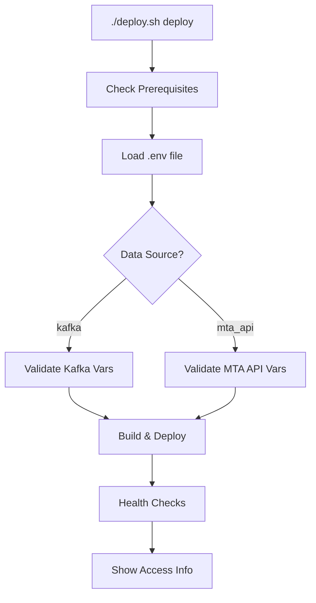

# 🔧 Deploy Script Updates for Kafka Integration

## ✅ What Was Updated

The deployment script (`deploy.sh`) has been enhanced to fully support the Kafka integration with comprehensive validation, testing, and monitoring capabilities.

### 🎯 Key Updates Made

#### 1. **Enhanced Environment Validation**
- ✅ **Data Source Detection**: Automatically detects `DEFAULT_DATA_SOURCE` setting
- ✅ **Conditional Validation**: Different validation rules for Kafka vs MTA API
- ✅ **Kafka Authentication**: Validates SASL_SSL credentials and configuration
- ✅ **Smart Error Messages**: Specific guidance based on selected data source

#### 2. **Updated Environment Template**
```bash
# NEW: Kafka-first configuration template
DEFAULT_DATA_SOURCE=kafka
KAFKA_BOOTSTRAP_SERVERS=your-kafka-broker:9092
KAFKA_SASL_USERNAME=your_kafka_username
KAFKA_SASL_PASSWORD=your_kafka_password
KAFKA_TOPIC=icymta
```

#### 3. **New Kafka Testing Command**
```bash
# Test Kafka connectivity and authentication
./deploy.sh test-kafka
```

#### 4. **Enhanced Health Checks**
- ✅ **Kafka Status**: Includes Kafka integration health in service checks
- ✅ **Data Source Aware**: Health checks adapt based on configured data source
- ✅ **Consumer Monitoring**: Validates Kafka consumer connectivity

#### 5. **Improved User Experience**
- ✅ **Smart Guidance**: Shows data source-specific setup instructions
- ✅ **Deployment Info**: Displays active data source and Kafka topic info
- ✅ **Troubleshooting**: Built-in connection testing and error guidance

## 🚀 New Deployment Workflow

### 1. **Initial Setup** (Automatic template creation)
```bash
./deploy.sh setup
```
Creates `.env` file with Kafka-first configuration template.

### 2. **Configure Environment**
Edit `.env` file with your credentials:
```bash
# For Kafka (Primary)
DEFAULT_DATA_SOURCE=kafka
KAFKA_BOOTSTRAP_SERVERS=your-cluster:9092
KAFKA_SASL_USERNAME=your_username
KAFKA_SASL_PASSWORD=your_password

# For MTA API (Fallback) 
# DEFAULT_DATA_SOURCE=mta_api
# MTA_API_KEY=your_api_key
```

### 3. **Test Kafka Connection** (New Feature)
```bash
./deploy.sh test-kafka
```
Validates:
- ✅ Kafka broker connectivity
- ✅ SASL_SSL authentication
- ✅ Topic access and message consumption
- ✅ JSON parsing capabilities

### 4. **Deploy Stack**
```bash
./deploy.sh deploy
```
Now includes:
- ✅ Data source validation
- ✅ Kafka-specific environment checks
- ✅ Enhanced health monitoring
- ✅ Data source-aware status display

## 📋 Enhanced Commands

### Environment Validation
The script now validates different variables based on data source:

**For Kafka Mode:**
- `KAFKA_BOOTSTRAP_SERVERS` ✅ Required
- `KAFKA_SASL_USERNAME` ✅ Required  
- `KAFKA_SASL_PASSWORD` ✅ Required
- `KAFKA_TOPIC` ✅ Optional (defaults to 'icymta')

**For MTA API Mode:**
- `MTA_API_KEY` ✅ Required

**Always Required:**
- `SNOWFLAKE_ACCOUNT`, `SNOWFLAKE_USER`, `SNOWFLAKE_PASSWORD` ✅

### New Test Command
```bash
# Test Kafka connectivity
./deploy.sh test-kafka

# Expected output:
🔧 Testing Kafka Connection
Bootstrap servers: your-cluster:9092
Topic: icymta
Username: your_username
==================================================
✅ Kafka consumer created successfully
✅ Subscribed to topic: icymta
📡 Polling for messages (30 seconds)...
📨 Message 1:
   Topic: icymta
   Partition: 0
   Offset: 12345
   Sample fields: ['vehicleref', 'lineref', 'recordedattime']...
✅ SUCCESS: Received 5 messages from Kafka
🎉 Kafka connection and authentication working correctly!
```

### Enhanced Status Display
```bash
./deploy.sh deploy
# Shows:
Data Source Configuration:
  • Primary Source:     kafka
  • Kafka Topic:        icymta  
  • Consumer Group:     snowpipe-streaming-consumer

Service Access URLs:
  • Application Health: http://localhost:8001/health
  • Test Kafka:         ./deploy.sh test-kafka
```

## 🔍 Troubleshooting Integration

### Built-in Error Guidance
The script now provides specific troubleshooting steps:

**For Authentication Errors:**
```bash
❌ Required Kafka variable KAFKA_SASL_USERNAME is not set in .env file
❌ For Kafka data source, please configure all Kafka authentication variables
```

**For Connection Issues:**
```bash
❌ Kafka connection test failed!

Troubleshooting steps:
  1. Verify Kafka credentials in .env file
  2. Check network connectivity to Kafka brokers  
  3. Ensure the icymta topic exists and has data
  4. Verify SASL/SSL configuration
```

### Validation Flow


## 📊 Benefits of Updated Script

### 🎯 Intelligent Validation
- **Conditional Requirements**: Only validates variables needed for selected data source
- **Early Error Detection**: Catches configuration issues before deployment
- **Specific Guidance**: Tells users exactly what to configure

### 🔧 Built-in Testing
- **Pre-deployment Testing**: Test Kafka before full deployment
- **Authentication Validation**: Verifies SASL_SSL credentials work
- **Topic Access Confirmation**: Ensures topic exists and is accessible

### 📱 Better User Experience
- **Smart Defaults**: Kafka-first configuration with sensible defaults
- **Clear Instructions**: Step-by-step guidance based on data source
- **Status Awareness**: Shows what's actually configured and running

### 🛠️ Operational Excellence
- **Comprehensive Health Checks**: Data source-aware monitoring
- **Troubleshooting Support**: Built-in diagnostic capabilities
- **Production Ready**: Robust error handling and validation

## 🎉 Migration Complete!

The deploy script now provides enterprise-grade deployment automation for Kafka-integrated MTA data streaming with:

✅ **Intelligent Configuration Management**  
✅ **Built-in Kafka Testing and Validation**  
✅ **Data Source-Aware Operations**  
✅ **Comprehensive Error Guidance**  
✅ **Production-Ready Deployment Flow**  

Your Kafka integration is now fully supported by a robust, user-friendly deployment pipeline!